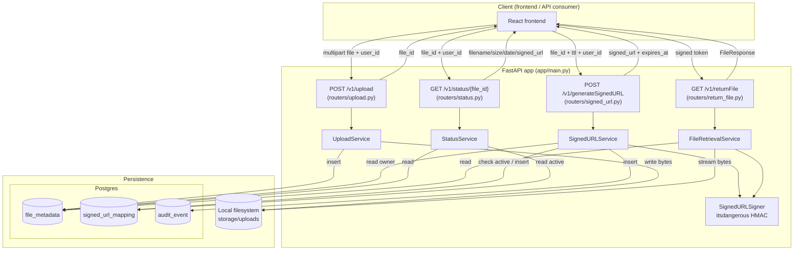
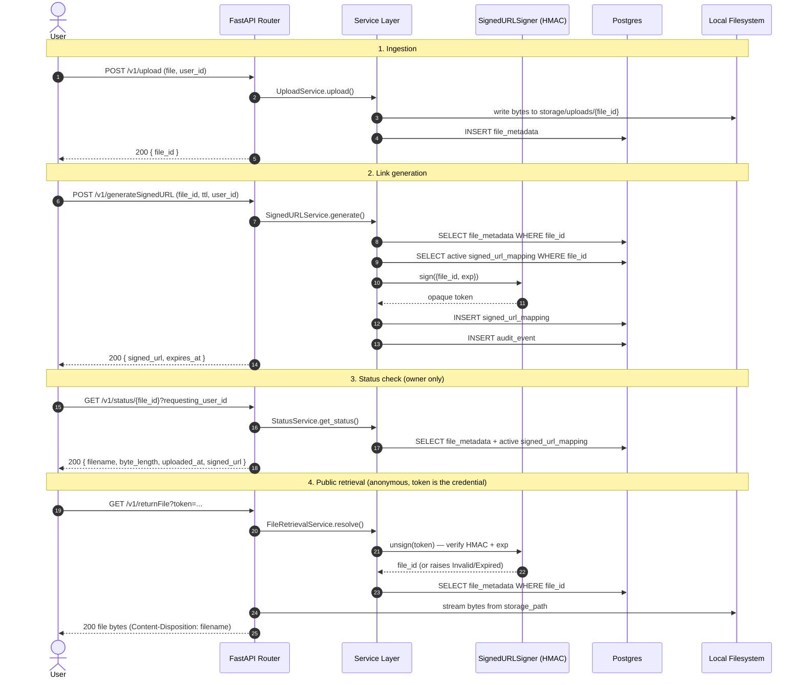

# Architecture Flow Diagram

High-level map of the request lifecycle and data flow across the four APIs.
Use this as the anchor for technical review — see [functionalspec.md](functionalspec.md)
for requirements and [codingspec.md](codingspec.md) for per-API implementation detail.

## Component / Layering View

Every request flows through the same layers: **router → service → repository
→ SQLAlchemy model → Postgres**. Routers own HTTP concerns (status codes),
services own business rules, repositories own persistence.

## Request Lifecycle (Sequence View)

The end-to-end flow a file takes from ingestion to public retrieval:

## Key Data-Flow Properties

- **Stateless validity**: `returnFile` never re-checks `signed_url_mapping`
  at retrieval time — the signature + embedded `exp` in the token is the
  sole source of truth, so validation survives service restarts and doesn't
  require a DB round trip's result to be authoritative.
- **Ownership gate**: `generateSignedURL` and `status` both compare
  `file_metadata.user_id` against a caller-supplied `requesting_user_id`
  (no session/auth token backs this — see [codingspec.md](codingspec.md) notes).
- **One active link per file**: `generateSignedURL` checks
  `signed_url_mapping` for a non-expired row before minting a new token,
  enforcing at most one live signed URL per file at a time.
- **Audit trail**: every successful `generateSignedURL` call writes an
  `audit_event` row, independent of whether the link is ever used.
- **Two persistence stores**: file bytes live on local disk
  (`storage/uploads/{file_id}`), all metadata/audit/mapping records live in
  Postgres — a retrieval always requires both to be consulted.
